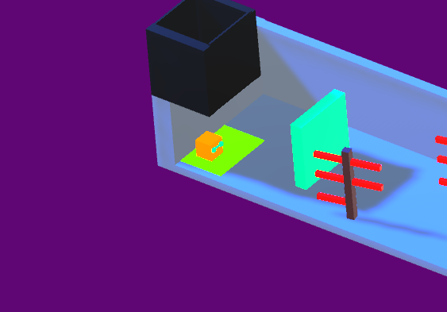
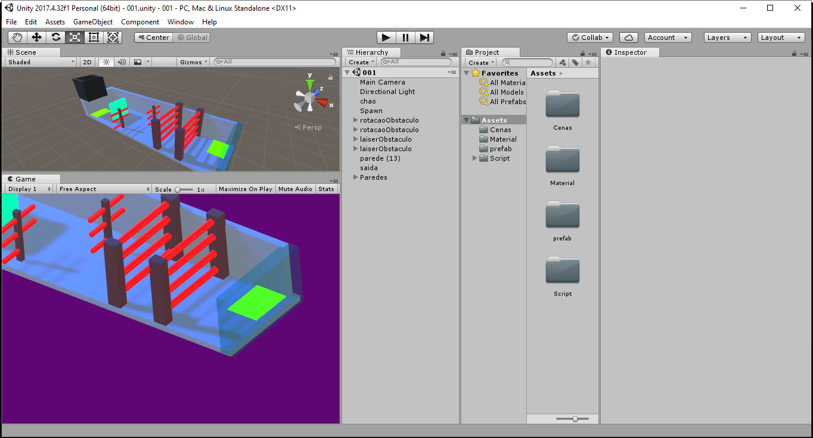

# Game Unity
Jogo desenvolvido usando a Unity 2017.4.32 como um teste 

    Para jogar o jogo use as teclas A,S,D,W ou as setas para se movimentar.

---

---

---

# Rodar o jogo no PC

Para rodar o jogo no pc, extraia o arquivo GameCubeUnity_Data e execute o arquivo GameCubeUnity. Ele não é um instalador. 